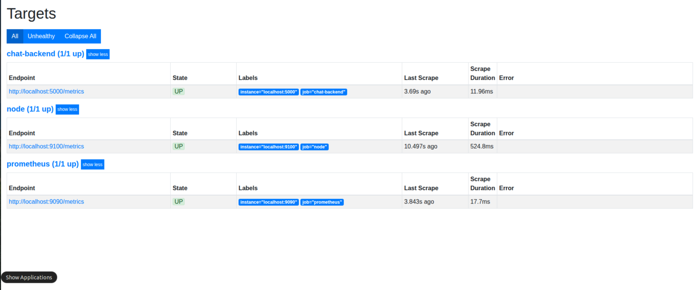
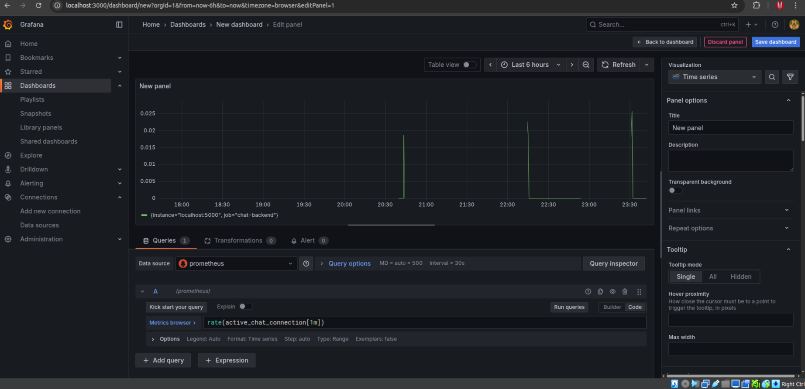

## Simple Chat Backend with Redis+Grafana+Prometheus

<p align="center" style="display: flex; justify-content: center; gap: 150px;">
   
   
</p>


### Redis Pub/Sub
Redis Pub/Sub is a messaging paradigm within the Redis server that enables real-time, one-to-many communication between different components of a distributed system. It operates on a publish-subscribe model, where publishers send messages to specific "channels" without knowing who the recipients are, and subscribers listen to these channels to receive messages they are interested in.

Source: Google


The project is real-time chat application built with the following tools:

1. Express.js
2. Redis - Publisher/Subscriber layer
3. Socket.io - for real time socket connection
4. Grafana - visualization of metrics
5. Prometheus - scraping data from api endpoints


### Setting up project locally


Clone the repository
```bash
git clone https://github.com/uchiha-vivek/RedisChat.git
```

Navigate to the folder RedisChat
```bash
cd RedisChat
```

Install the  packages
```bash
npm install
```

Run the server
```
npm run dev
```

Emit the message
```
npm run queue
```

## Configuring Prometheus

Open the prometheus configuration file
```
sudo nano /etc/prometheus/prometheus.yml
```

Add the following configuration there by scrolling to the bottom:
```bash
scrape_configs:
  - job_name: "chat-backend"
    static_configs:
      - targets: ["localhost:5000"]
```

Save file CTRL + S and  Enter, CTRL + X.

Restart the Prometheus
```bash
sudo systemctl restart prometheus
```

Now check the targets

```bash
http://localhost:9090/classic/targets
```


Navigate to ```http://localhost:9090/classic/graph?```
and paste ```active_chat_connection``` in expression placeholder




How to visualize the metrics in Grafana:
Open ```http://localhost:3000```


Add prometheus as new data source and use the below queries to see the performance
```bash
rate(chat_messages_total[1m])
```



Prometheus takes the per-second average increase of the counter over the last 1 minute window.

```bash
increase(chat_messages_total[1m])
```

I have used visualization as ```time series```.


For Redis concepts , visit to the following repo
[Redis concepts](https://github.com/uchiha-vivek/Redis-concepts)


### Installing Prometheus and Grafana in windows


Here we will use Chocolatey:


[Chocolatey Requirements](https://docs.chocolatey.org/en-us/choco/setup/#requirements)

Install with PowerShell.exe
```bash
Set-ExecutionPolicy Bypass -Scope Process -Force; [System.Net.ServicePointManager]::SecurityProtocol = [System.Net.ServicePointManager]::SecurityProtocol -bor 3072; iex ((New-Object System.Net.WebClient).DownloadString('https://community.chocolatey.org/install.ps1'))
```

Check the version
```bash
choco -v
```

Installing Prometheus
```bash
choco install prometheus -y
```

Installing grafana
```bash
choco install grafana -y
```


start the services
```bash
net start prometheus
net start grafana
```